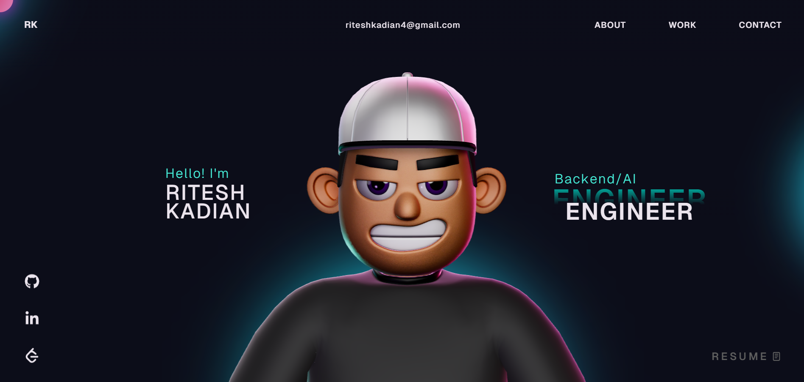

# My Portfolio Wesbite - Overview 🚀
An interactive developer portfolio showcasing my work in backend systems, AI-powered tools, and modern web technologies.

## 🛠️ Tech Stack

- Frontend — React, TypeScript, HTML, CSS, JavaScript
- Animation — GSAP (Club Plugins), Three.js, WebGL
- Deployment — Vercel

## Features

- Interactive 3D character scene
- Smooth GSAP scroll animations
- Clean and responsive UI
- Sections for projects, skills, and experience
- Optimized for performance and modern browsers

## Local Development

Clone the repository and run the project locally.

- git clone https://github.com/Riteshkadiann/Portfolio.git
- cd Portfolio
- npm install
- npm run dev

## Instructions
I have modified the gsap club plugins with the trial plugins, but with the trial plugin you cannot host it. So for Club plugins, Check out here: https://gsap.com/docs/v3/Installation/
